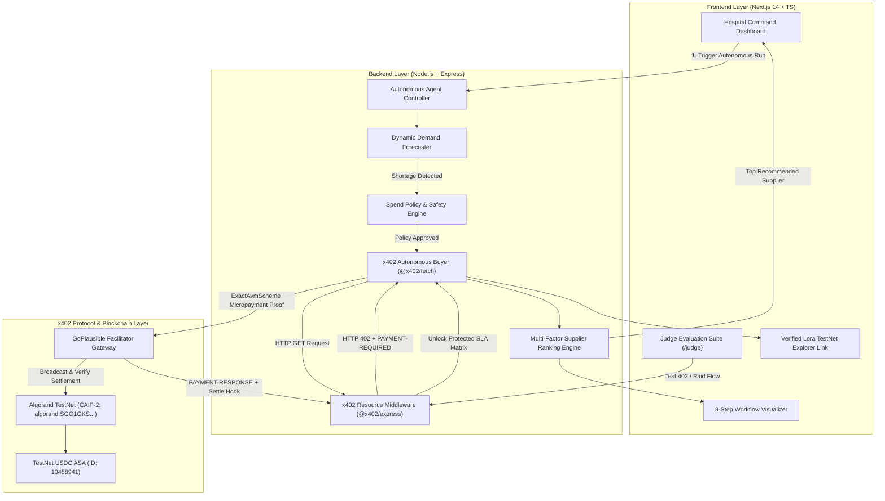
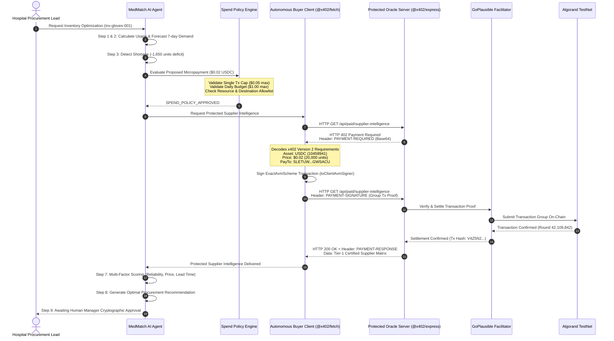

# 🏛️ MedMatch AI — System Architecture & Protocol Specification

## 1. System Architecture Overview

MedMatch AI implements a decentralized, autonomous agent procurement pipeline combining **x402 Protocol v2**, **Algorand TestNet settlement**, the **GoPlausible Facilitator**, an **AI Spend Policy Engine**, and a **Next.js 14 Web Command Center**.



---

## 2. Sequence Diagram: x402 Protocol Micropayment & Algorand Settlement



---

## 3. Spend Policy Safety Specification

The Spend Policy Engine enforces 6 layers of protection before any payment proof is signed:

1. **Endpoint Allowlisting:** Payments only permitted for verified internal endpoints (`/api/paid/supplier-intelligence`).
2. **Network Whitelisting:** Payments strictly locked to `algorand:SGO1GKSzyE7IEPItTxCByw9x8FmnrCDe` (Algorand TestNet).
3. **Asset Validation:** Payments only allowed in verified `USDC` (ASA `10458941`).
4. **Single Transaction Ceiling:** Hard cap of **$0.05 USD** per transaction.
5. **Cumulative Daily Budget:** Hard cap of **$1.00 USD** per hospital per UTC day.
6. **Idempotency & Replay Protection:** Duplicate procurement runs reuse previously settled proofs without double-charging.

---

## 4. Multi-Factor Supplier Ranking Formulation

When protected supplier intelligence is unlocked, candidates are scored dynamically:

$$\text{Final Score} = (w_r \times S_r) + (w_d \times S_d) + (w_p \times S_p) + (w_a \times S_a)$$

Where:
- **$S_r$ (Reliability Score, Weight = 35%):** Historic SLA delivery fulfillment rate (0-100).
- **$S_d$ (Delivery Lead Time Score, Weight = 25%):** Normalized turnaround penalty vs hospital criticality.
- **$S_p$ (Unit Pricing Score, Weight = 25%):** Price competitiveness vs baseline catalog.
- **$S_a$ (Inventory Availability Score, Weight = 15%):** Immediate batch capacity guarantee.

---

## 5. Zero-Key Browser Architecture

```
┌────────────────────────────────────────────────────────┐
│                   BROWSER ENVIRONMENT                  │
│  - No Algorand Mnemonics                               │
│  - No Private Keys                                     │
│  - Read-Only Public Blockchain Data                    │
│  - Real-Time Live Receipts & Explorer Links            │
└───────────────────────────┬────────────────────────────┘
                            │ Safe HTTP APIs
                            ▼
┌────────────────────────────────────────────────────────┐
│                   SERVER NODE RUNTIME                  │
│  - Private Mnemonic Isolated in Server Environment     │
│  - toClientAvmSigner Executes Server-Side Only         │
│  - Automated Secret Scan in CI/CD (npm run security:check)
└────────────────────────────────────────────────────────┘
```
